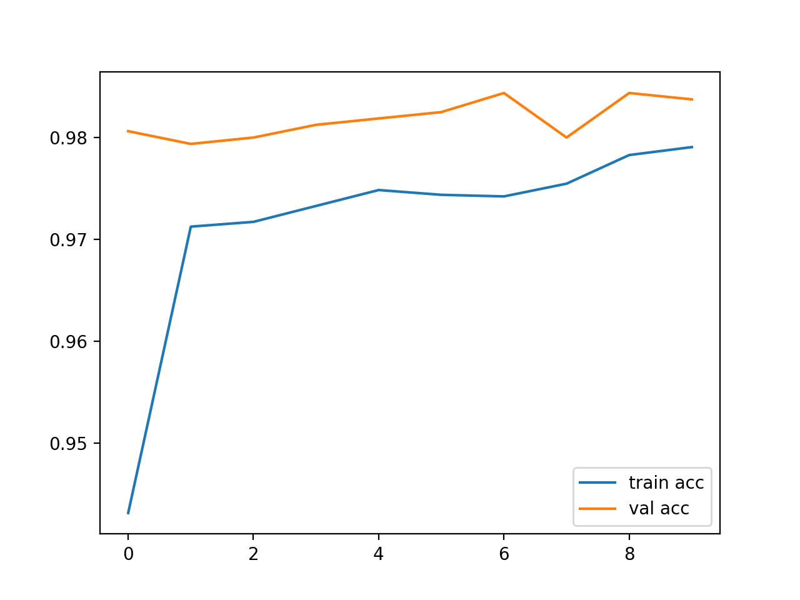

# Cat vs Dog Classification with Transfer Learning

This project demonstrates a **binary image classification** task (cats vs dogs) using **Transfer Learning with MobileNetV2** on the [Kaggle Cats and Dogs dataset](https://www.kaggle.com/datasets/tongpython/cat-and-dog).

---

## Project Overview

* Implemented in **TensorFlow / Keras**
* Dataset loaded automatically from Kaggle
* Transfer learning with **MobileNetV2** (pre-trained on ImageNet)
* Data augmentation for better generalization
* Early stopping and checkpointing during training
* Evaluation with accuracy, classification report, and confusion matrix
* Single image prediction demo

---

## Installation

Clone the repository and install the dependencies:

```bash
git clone https://github.com/cansuguzel/cat-dog-classifier.git
cd cat-dog-classifier
pip install -r requirements.txt
```

---

## Dataset Setup

1. Get your **Kaggle API key** (`kaggle.json`) from [Kaggle Account Settings](https://www.kaggle.com/account).
2. In Google Colab, upload kaggle.json using the file upload dialog.
3. The notebook [`notebooks/cat_recognition.ipynb`](notebooks/cat_recognition.ipynb) will automatically download and extract the dataset.

---

## Notebook Structure

1. **Setup & Dataset Download** – Install dependencies, download & extract dataset
2. **Data Preprocessing** – Using `ImageDataGenerator` for train/validation/test splits
3. **Model Architecture** – MobileNetV2 base + custom dense layers
4. **Training the Model** – EarlyStopping, ModelCheckpoint, training curves
5. **Plot Performance**
6. **Evaluation on Test Set** – Accuracy, classification report, confusion matrix
7. **Single Image Prediction** – Upload and classify a single cat/dog image
8. **Save Model**

---

## Results

* Achieved ~98% test accuracy 

* Robust generalization due to transfer learning and augmentation

Example training accuracy curve:




* Developed with **Google Colab** and **TensorFlow**
* Easily extendable to other binary classification problems
